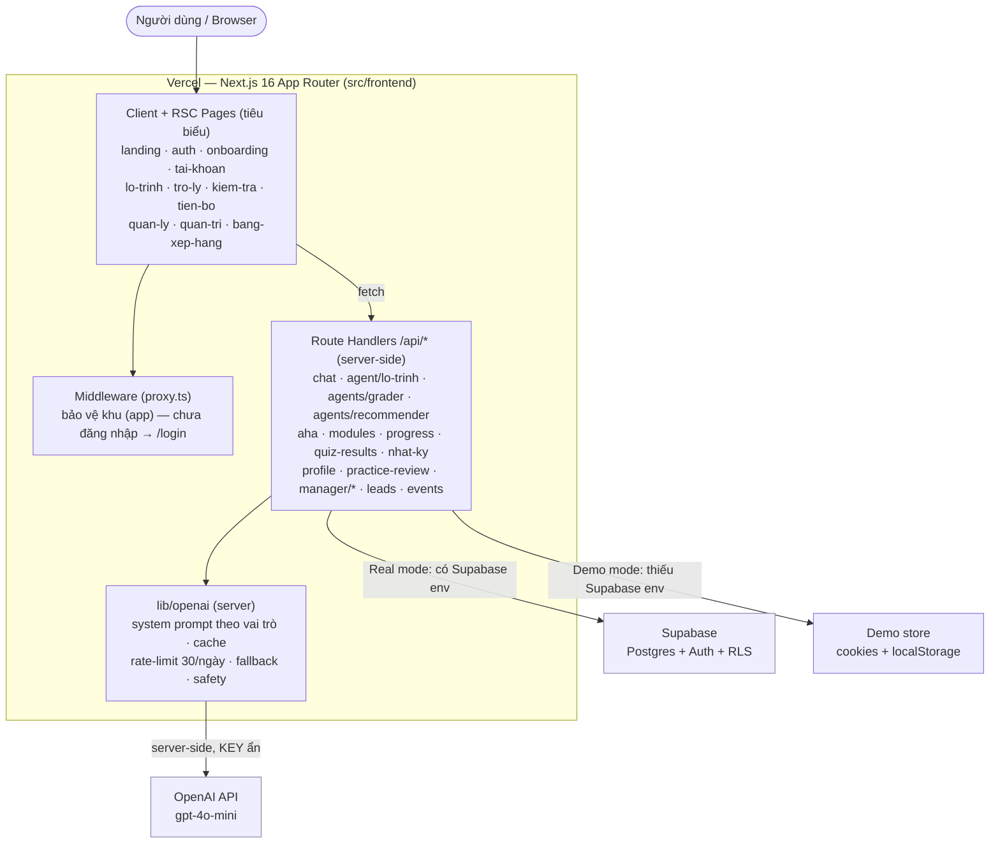
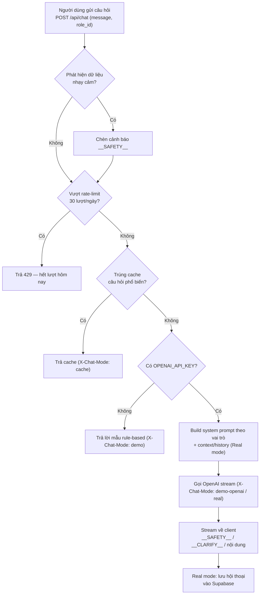

# Architecture Diagram — AI Trợ Lý

> Stack thật của sản phẩm: **Next.js 16 (App Router) + Supabase + OpenAI**, deploy trên **Vercel**.
> KHÔNG dùng FastAPI / LangGraph / ChromaDB (đó là boilerplate gốc, đã archive ở `legacy/python-boilerplate/`).

## 1. System Overview

**Hai chế độ chạy:**
- **Real mode** — có `NEXT_PUBLIC_SUPABASE_URL/ANON_KEY`: auth + dữ liệu (profiles, progress, quiz, time_logs, chat memory...) lưu Supabase, bảo vệ bằng RLS.
- **Demo mode** — thiếu env Supabase: chạy đầy đủ bằng cookies + localStorage (phục vụ demo, không cần backend).

## 2. Data Flow — Trợ lý AI (`/api/chat`)

> `__SAFETY__` (cảnh báo an toàn) và `__CLARIFY__` (hỏi làm rõ, clarify-first) là **protocol streaming**: client (`use-assistant-chat.ts`) parse thành cảnh báo / thẻ card. Cùng định dạng ở cả đường demo và real.

## 3. Component Details (đúng thực tế)

| Thành phần | Công nghệ | Vai trò |
|-----------|-----------|---------|
| Frontend | **Next.js 16 App Router** (React 19, Tailwind v4, shadcn/ui, Recharts) | Giao diện + RSC; toàn bộ trong `src/frontend/` |
| API | **Next.js Route Handlers** (`/app/api/*`) | Xử lý phía server, gọi LLM/DB; **không có backend riêng** |
| Auth bảo vệ route | **Middleware** (`proxy.ts`) | Chặn khu `(app)` khi chưa đăng nhập |
| LLM | **OpenAI `gpt-4o-mini`** qua `lib/openai` | Trợ lý + agent lộ trình; key chỉ ở server, có cache/rate-limit/fallback/safety |
| Backend / DB | **Supabase** (Postgres + Auth + RLS) | Lưu dữ liệu người dùng, mỗi user chỉ truy cập dữ liệu của mình (RLS) |
| Demo store | cookies + localStorage | Chạy demo không cần Supabase |
| Hosting | **Vercel** (preset Next.js) | Deploy, env vars cấu hình trên dashboard |
| AI usage log | hooks → `.ai-log/session.jsonl` → grading server | Ghi nhận prompt AI (yêu cầu khóa học) |

## 4. Nguyên tắc bảo mật
- Mọi lời gọi OpenAI đi qua Route Handler phía server — client **không bao giờ thấy** `OPENAI_API_KEY`.
- **RLS bật trên mọi bảng** Supabase; user chỉ đọc/ghi dữ liệu của chính mình.
- `SUPABASE_SERVICE_ROLE_KEY` chỉ dùng server-side (vd quản lý invite link).
- Trợ lý cảnh báo khi người dùng paste dữ liệu nhạy cảm (`__SAFETY__`).
