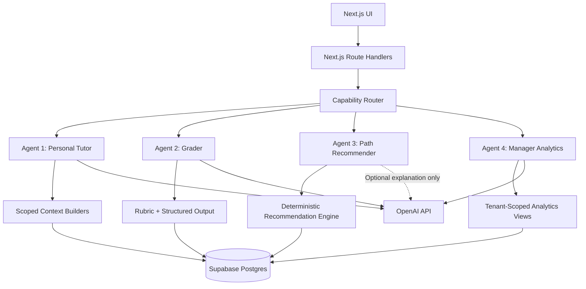

# Phase 2 — Company Learning Platform & Four AI Capabilities

> AI Tro Ly · Team 09
> Status: Draft for implementation
> Created: 2026-06-11
> Source of truth for Phase 2 product scope, architecture, task order, and acceptance criteria.

> [!IMPORTANT]
> Phase 2 extends the current Next.js 16 + Supabase application. It does not
> replace the current app, migrate to Vite, or introduce a separate Python
> backend.

## 1. Product Outcome

Phase 2 turns the current personal AI learning application into a
company-scoped learning platform.

A company can:

- create an organization space and company entry link;
- invite employees and manage departments and job roles;
- compose a common AI foundation path plus specialist paths;
- assign paths to employees;
- evaluate practical capability, not only lesson completion;
- create internal learning momentum through reflections, achievements, and
  leaderboards;
- use a manager assistant to understand training effectiveness.

An employee can:

- join the correct company through an invite;
- sign in with Google or the existing email/password flow;
- receive a path based on company, job role, AI level, goals, and assessment;
- learn with a personal AI tutor;
- submit practical work and receive actionable feedback;
- capture an "Aha Moment" and state how it will be applied at work;
- optionally share useful prompts, reflections, and achievements internally.

## 2. Phase 2 Principles

1. **Deterministic first, LLM second.** SQL, scoring rules, prerequisites,
   quizzes, rankings, and permission checks must not consume tokens.
2. **One request, one AI capability.** The four capabilities do not chat with
   one another or form an autonomous multi-agent loop.
3. **Company data is tenant-scoped.** Every company-owned row includes
   `organization_id`; RLS or server authorization enforces isolation.
4. **Human-visible reasons.** Recommendations and grades show the rubric,
   evidence, confidence, and a correction path.
5. **Privacy before competition.** Reflections are private by default.
   Sharing to a team or company is explicit.
6. **Build on the current stack.** Reuse Next.js Route Handlers, Supabase Auth,
   Postgres, RLS, Storage, Recharts, and the existing OpenAI SDK.

## 3. Current State Audit

Legend:

- **Done:** real implementation exists in the current codebase.
- **Partial:** a useful slice exists, but it does not satisfy the Phase 2
  outcome.
- **Not started:** no production implementation exists.
- **Hardening required:** implemented but must be corrected before expansion.

### 3.1 Four AI Capabilities

| Capability | Status | Current evidence | Missing for Phase 2 |
|---|---|---|---|
| Agent 1 — Personal tutor | **Done / extend** | Role-aware chat, employee progress context, chat history, long-term memory, safety warning, daily rate limit | Add company, department, job-role, assigned-path, and Aha Moment context; add per-organization AI budget |
| Agent 2 — Assignment grader | **Partial** | Deterministic quiz scoring; AI image-based practice grading; score, feedback, strengths, improvements, and history | Text/essay answers, company rubrics, rubric versions, confidence, regrade, manager review queue, usage ledger |
| Agent 3 — Path recommender | **Partial** | Onboarding assessment, role-based modules, `ai_level` filtering, static/Supabase module fallback | Company-defined roles and paths, common + specialist composition, prerequisite/gap rules, recommendation reasons, assignment acceptance |
| Agent 4 — Manager analytics assistant | **Done / extend** | Manager chat reads organization-scoped team progress, quiz, and time-log data; dashboard/team API uses real organization membership | Custom department/job-role dimensions, assessment quality, Aha/application signals, privacy-safe views, saved reports and organization budget visibility |

### 3.2 Company And Employee Management

| Requirement | Status | Notes |
|---|---|---|
| Organization and membership schema | **Done** | `organizations`, `organization_members`, owner/manager/employee roles |
| Real manager route/API authorization | **Done** | Membership is the real-mode source of truth |
| Token-only invite link | **Done** | Create, copy, rotate, validate, and accept `/moi/[token]` |
| Employee full name and phone profile | **Done** | Registration collects both fields |
| Add an existing account by email | **Done** | Manager team API verifies Supabase Auth user |
| Admin/owner creates a company in UI | **Not started** | Current migration creates/backfills a default organization only |
| Stable company entry link | **Not started** | Need `/c/[organizationSlug]`; invite token remains the join authority |
| Google sign-in | **Not started** | Existing auth is email/password |
| Phone OTP sign-in | **Not started** | Requires an SMS provider and cost controls |
| Custom departments | **Not started** | Current `department_id` is a fixed text enum |
| Custom job positions | **Not started** | No separate job-role entity |
| Manager edits member department/position | **Not started** | Current UI only adds by email and optional manager access |
| Multi-organization production smoke test | **Not completed** | BE-08 Phase 2.5 and BE-10 Phase 3.6 remain open |

### 3.3 Company-Designed Learning Paths

| Requirement | Status | Notes |
|---|---|---|
| Global module catalog | **Done** | `learning_modules` plus static fallback |
| Role and AI-level filtering | **Partial** | Five fixed role IDs; advanced users skip basic modules |
| Common AI foundation path | **Partial** | Content exists, but there is no reusable company-assigned common track |
| Specialist paths | **Partial** | Fixed paths exist for sales, accounting, marketing, operations, and other |
| Company creates/edits module | **Not started** | No authoring API or UI |
| Company creates path per job position | **Not started** | No company path, version, assignment, or prerequisite schema |
| Developer path | **Not started** | Current role IDs do not include developer |
| Manager assigns/reassigns paths | **Not started** | No assignment workflow |

### 3.4 Community, Competition, And Aha Moment

| Requirement | Status | Notes |
|---|---|---|
| Manager leaderboard view | **Partial** | Dashboard ranks team members by completion |
| Employee-visible leaderboard | **Not started** | No personal/team/company leaderboard page |
| Activity feed | **Not started** | No company learning feed |
| Aha Moment reflection | **Not started** | No structured post-lesson reflection |
| Share practical application | **Not started** | No visibility setting or internal post |
| Prompt sharing | **Not started** | No reusable company prompt post/library |
| Badges and achievements | **Not started** | No badge rules or awards |
| Notifications | **Not started** | No in-app learning notification table or UI |

## 4. Scope

### 4.1 Must Ship In Phase 2

- Company creation by an authenticated owner.
- Stable company entry page: `/c/[organizationSlug]`.
- Existing token invite flow integrated with the company entry page (with
  `expires_at`, `max_uses`, and `used_count` enforcement — already in migration
  0013).
- Google OAuth.
- Company departments and job roles.
- Member assignment to department and job role.
- Company learning path authoring and versioning; **AI-assisted first draft**
  of a module or rubric is part of authoring UX (manager provides all required
  fields; AI drafts content; manager reviews and publishes).
- Common foundation track plus specialist track composition.
- Path assignment to employees.
- Deterministic path recommendation with visible reasons.
- Open/practical assignment grading with rubric and confidence.
- Aha Moment reflection after lessons (private by default; sharing is
  explicitly opt-in per reflection, not a global setting).
- Individual, department, and company leaderboards with **opt-in visibility
  per employee** (employees may hide their name from company-wide view).
- Manager analytics using real tenant-scoped data.
- Organization-level AI usage and budget controls.

### 4.2 Optional Behind Feature Flag

- Phone OTP login.
- Company activity feed for explicitly shared learning events (badges,
  completed paths, shared Aha Moments, shared prompts). Community feed
  surfaces shared content that employees have explicitly published; completion
  events are off by default and enabled by company policy.
- Badges and achievements.
- Weekly AI-written manager digest.
- Comments and reactions on community posts.
- Bulk import from Excel.

### 4.3 Out Of Scope

- Custom company subdomains.
- Billing, invoicing, and automatic seat charging.
- SCIM or enterprise SSO.
- Public company directory.
- Fully autonomous agents that modify employee records without confirmation.
- Cross-company benchmarking.
- Automatic HR performance decisions.
- Real-time chat between employees.

## 5. Company Model

### 5.1 Roles And Permissions

| Role | Permissions |
|---|---|
| `owner` | Company settings, managers, departments, roles, paths, assignments, reports |
| `manager` | Team members, assigned departments, paths, progress, reports, invite links |
| `employee` | Own learning, own submissions, own reflections, shared company content |

Platform administration is not part of the organization role model. Company
creation is self-service: the creator becomes `owner`.

### 5.2 Company Entry And Invite Flow

Canonical routes:

```text
/c/[organizationSlug]            Company-branded login/entry page
/moi/[token]                     Secret join invitation
/moi/[token]/accept              Explicit invite acceptance action
/quan-ly/cong-ty                 Company settings
/quan-ly/phong-ban               Departments and job roles
/quan-ly/lo-trinh                Company learning paths
/quan-ly/phan-cong               Employee path assignments
```

Rules:

1. `/c/[organizationSlug]` is discoverable only when the URL is known; it does
   not add a user to the company.
2. `/moi/[token]` is the bearer invitation that authorizes joining.
3. Existing members can sign in through the company page and return to that
   organization.
4. A new employee can authenticate with Google or email/password, then accept
   the invite.
5. Invite acceptance must use an explicit `POST`, not a state-changing `GET`.
6. Personal Google accounts are allowed because the invite token, not the email
   domain, determines company membership.
7. Phone number remains a required profile field. Phone OTP is feature-flagged
   until an SMS provider and abuse budget are approved.

## 6. Learning Model

### 6.1 Path Composition

An employee's active path is composed in this order:

```text
Company common foundation
  + Job-role specialist track
  + Assessment gap modules
  + Manager-required modules
  - Already mastered equivalents
```

Example:

```text
Common foundation
  - AI safety and company data
  - Effective prompting
  - AI tool basics
  - Search and synthesis

Marketing specialist
  - Content planning
  - Advertising image brief
  - Campaign plan

Gap modules
  - Prompt fundamentals, only when assessment shows a gap
```

### 6.2 Content Ownership

- `global`: maintained by the product team and reusable across companies.
- `organization`: private content owned by one company.
- Company paths may reference both global and organization modules.
- Published content is immutable. Editing creates a new version.
- Existing assignments remain pinned to their assigned version until a manager
  explicitly upgrades them.

### 6.3 Authoring

Managers create modules from a structured form:

- title and business outcome;
- target department/job role;
- level and estimated duration;
- learning sections;
- practice instruction;
- assessment rubric;
- safety/data policy notes.

AI may draft content only after the manager provides these fields. The manager
must review and publish the draft. AI never publishes automatically.

## 7. Aha Moment And Internal Community

### 7.1 Post-Lesson Aha Flow

After a lesson or passing practice, ask:

1. **Aha:** "Điều gì vừa khiến bạn hiểu ra?"
2. **Application:** "Bạn sẽ áp dụng điều này vào công việc nào?"
3. **Next action:** "Bước nhỏ nào bạn sẽ thử trong 24 giờ tới?"
4. **Visibility:** Private, department, or company.

The reflection is saved even when private. Sharing is optional.

Agent 1 may offer an on-demand action:

> "Biến Aha Moment này thành kế hoạch thử nghiệm 3 bước."

This action consumes tokens only when the employee requests it.

### 7.2 Feed Events

The company feed can show:

- completed lesson;
- passed practical assignment;
- earned badge;
- shared Aha Moment;
- shared prompt;
- completed path.

Only explicitly shared text content appears. Completion events can be enabled
or disabled by company policy.

### 7.3 Leaderboards

Views:

- individual within department;
- department within company;
- company-wide individual;
- weekly and all-time.

Points are generated server-side from trusted events:

| Event | Points |
|---|---:|
| Complete lesson | 10 |
| Pass practical assignment | 20 |
| Complete path | 50 |
| Share approved Aha Moment | 5 |
| Share approved prompt | 5 |

Sharing points are capped at 20 per week to avoid spam. Time logged is not used
as leaderboard score because it is self-reported and easy to game.

## 8. Four-Capability Architecture



### 8.1 Agent 1 — Personal Tutor

Inputs:

- employee profile and AI level;
- company, department, and job role;
- assigned path and current module;
- recent progress and assessment gaps;
- recent conversation and long-term memory;
- company AI safety policy.

Allowed actions:

- explain lesson content;
- create job-specific examples and prompts;
- suggest the next assigned module;
- turn an Aha Moment into an action plan after confirmation.

Not allowed:

- change a path assignment;
- mark a lesson complete without the normal completion flow;
- expose another employee's data.

### 8.2 Agent 2 — Assignment Grader

Grading path:

```text
MCQ / fixed answer
  -> deterministic scoring, no LLM

Open text / practical image
  -> rubric + evidence extraction
  -> structured grade
  -> confidence check
  -> pass, needs revision, or manager review
```

Required output:

```json
{
  "score": 0,
  "rubricBreakdown": [],
  "evidence": [],
  "strengths": [],
  "improvements": [],
  "confidence": 0,
  "reviewStatus": "auto-approved"
}
```

Rules:

- Store rubric version and model snapshot with every grade.
- A low-confidence result or score near a pass boundary enters
  `manager-review`.
- A regrade never overwrites history.
- The employee sees evidence and how to improve.

### 8.3 Agent 3 — Path Recommender

The core recommendation is deterministic.

Hard filters:

- same organization or global content;
- published and active version;
- job-role eligibility;
- prerequisites satisfied;
- not already mastered.

Suggested scoring:

| Signal | Weight |
|---|---:|
| Job-role match | 35 |
| Assessment gap match | 25 |
| Employee goal match | 20 |
| AI-level fit | 15 |
| Manager priority | 5 |

The output stores reason codes, for example:

```text
ROLE_MATCH
ASSESSMENT_GAP
MANAGER_REQUIRED
PREREQUISITE
ALREADY_MASTERED
```

An LLM may rewrite the reason codes into friendly Vietnamese, but the ranking
must remain reproducible without an LLM.

### 8.4 Agent 4 — Manager Analytics

All metrics are calculated by SQL or TypeScript aggregation first. The LLM
receives a bounded summary, not raw organization tables.

It can answer:

- Who is falling behind?
- Which department needs support?
- Who is improving?
- Which modules have low pass rates?
- Which employees applied learning to real work?
- What should the manager prioritize this week?

It must:

- state the reporting period;
- show the data used;
- separate facts from recommendations;
- state when data is insufficient;
- never recommend termination, compensation, or disciplinary action.

## 9. Technology Decisions

| Area | Decision | Reason |
|---|---|---|
| Web application | Keep Next.js 16 App Router + React 19 | Current production stack and deployment model |
| API | Keep Next.js Route Handlers | Avoid a second backend/runtime |
| Database/auth/storage | Keep Supabase Postgres, Auth, RLS, Storage | Existing tenant data and user flows already use it |
| Company login | Supabase Google OAuth with PKCE; keep email/password | Google is low-friction and supported by the current auth provider |
| Phone login | Supabase Phone OTP behind a feature flag | Requires paid SMS provider, anti-abuse controls, and operating budget |
| Agent orchestration | TypeScript capability modules under `lib/agents/` | Current flows are bounded single-purpose operations; LangGraph is unnecessary |
| LLM API | Use OpenAI Responses API for new Phase 2 agent endpoints | Recommended API primitive for new OpenAI integrations |
| Default model | Keep `gpt-4o-mini` for tutor and routine grading | Existing model, vision support, structured outputs, lowest practical cost |
| Escalation model | `gpt-5.4-mini` only for explicitly flagged complex regrade or curriculum draft review | Higher reasoning quality but materially higher token price |
| Structured responses | JSON Schema / Structured Outputs | Stable grading and recommendation contracts |
| Charts | Keep Recharts | Already used by manager dashboard |
| Async non-urgent AI | OpenAI Batch API where 24-hour turnaround is acceptable | Lower cost for bulk evaluation or offline classification |
| Search/RAG | Postgres full-text search first; add `pgvector` only when semantic retrieval has a measured need | Avoid premature vector infrastructure |
| Realtime feed | Polling first; Supabase Realtime only after feed volume requires it | Simpler correctness and lower operational complexity |

### 9.1 Why Not LangGraph Yet

The four capabilities are not four autonomous workers. Each has a bounded
input, bounded output, and known data access. A small TypeScript interface is
enough:

```ts
type AgentCapability<I, O> = {
  name: "tutor" | "grader" | "recommender" | "manager-analytics";
  execute(input: I, context: AgentContext): Promise<O>;
};
```

Introduce a workflow framework only when a capability truly requires
multi-step tool loops, durable execution, retries across process restarts, or
human approval checkpoints that cannot be represented cleanly in the current
Route Handler flow.

## 10. Token And Cost Strategy

### 10.1 Routing Policy

| Operation | LLM? | Default |
|---|---|---|
| MCQ scoring | No | TypeScript |
| Progress, leaderboard, department statistics | No | SQL/TypeScript |
| Path ranking | No | Deterministic rules |
| Path reason wording | Optional | Template first, LLM on request |
| Personal tutor | Yes | `gpt-4o-mini` |
| Open/practical grading | Yes | `gpt-4o-mini` |
| Low-confidence regrade | Optional | `gpt-5.4-mini` with policy gate |
| Manager facts and metrics | No | SQL/TypeScript |
| Manager narrative/recommendation | Yes | `gpt-4o-mini` |
| Bulk offline evaluation | Yes | Batch API |

### 10.2 Guardrails

- Keep stable instructions and rubrics at the beginning of prompts so prompt
  caching can reuse exact prefixes.
- Send only the current organization, current path, and needed evidence.
- Keep tutor history bounded; preserve the current recent-message + summary
  pattern.
- Cap tutor output near 300 words, grading feedback near 250 words, and manager
  summaries near 400 words.
- Cache common explanations and deterministic recommendation reasons.
- Do not call the LLM when the user only opens a dashboard.
- Do not regenerate a grade unless the submission changed or a regrade was
  requested.
- Add per-user daily limits, per-capability limits, and a monthly organization
  budget.
- Fail safely: when budget is exhausted, deterministic learning and dashboard
  features continue to work.

### 10.3 Usage Ledger

Add `ai_usage_events`:

```text
id
organization_id
user_id
capability
model
input_tokens
cached_input_tokens
output_tokens
estimated_cost_usd
latency_ms
request_status
created_at
```

The manager sees monthly usage by capability. Exact pricing remains server
configuration so model price changes do not require a database migration.

## 11. Proposed Data Model

### 11.1 Tenant Structure

Add:

- `organizations.slug`, `logo_url`, `status`, `settings_json`.
- `organization_departments`
  - `id`, `organization_id`, `name`, `slug`, `is_active`.
- `organization_job_roles`
  - `id`, `organization_id`, `department_id`, `name`, `slug`,
    `description`, `is_active`.
- `organization_members.department_ref_id`.
- `organization_members.job_role_id`.

Migration compatibility:

- Keep the current text `organization_members.department_id` during rollout.
- Add UUID references with new names.
- Backfill known values.
- Update reads/writes.
- Remove or rename the legacy text field only in a later migration after
  production verification.

### 11.2 Learning Content

Add:

- `training_modules`
  - UUID identity, nullable `organization_id`, owner scope, content JSON,
    level, status, version, safety notes.
- `learning_paths`
  - organization/global scope, common/specialist type, job role, status,
    version.
- `learning_path_modules`
  - ordered module relationship, required/optional, prerequisite metadata.
- `learning_assignments`
  - user, path version, assigned by, status, assigned/start/due/completed time.
- `learning_recommendations`
  - candidate path/module, score, reason codes, engine version, accepted state.

The existing `learning_modules` table remains readable through an adapter until
global content is migrated to `training_modules`.

### 11.3 Assessment And Grading

Add:

- `assessments`
- `assessment_items`
  - `mcq`, `open-text`, `practical-image`.
- `assessment_submissions`
- `assessment_answers`
- `grading_results`
  - rubric version, score, breakdown, evidence, confidence, model, review
    status.
- `grading_reviews`
  - manager adjustment, reason, reviewer, timestamp.

### 11.4 Aha And Community

Add:

- `lesson_reflections`
  - Aha text, application context, next action, visibility.
- `community_posts`
  - `aha`, `prompt`, `achievement`; references source records.
- `activity_events`
  - trusted server-created events for feed and points.
- `badge_definitions`
- `user_badges`
- `notifications`
- SQL views or materialized views for leaderboard summaries.

## 12. API And Route Plan

### 12.1 Organization

```text
POST   /api/organizations
GET    /api/organizations/current
PATCH  /api/organizations/current
GET    /api/organizations/[slug]/public

GET    /api/manager/departments
POST   /api/manager/departments
PATCH  /api/manager/departments/[id]

GET    /api/manager/job-roles
POST   /api/manager/job-roles
PATCH  /api/manager/job-roles/[id]

PATCH  /api/manager/team/[memberId]
```

### 12.2 Learning

```text
GET    /api/manager/learning-paths
POST   /api/manager/learning-paths
PATCH  /api/manager/learning-paths/[id]
POST   /api/manager/learning-paths/[id]/publish

GET    /api/manager/training-modules
POST   /api/manager/training-modules
PATCH  /api/manager/training-modules/[id]

POST   /api/manager/assignments
GET    /api/learning/active-path
POST   /api/learning/recommendations/[id]/accept
```

### 12.3 Grading, Aha, And Community

```text
POST   /api/assessments/[id]/submit
POST   /api/grading/[submissionId]/regrade
PATCH  /api/manager/grading/[resultId]/review

POST   /api/reflections
PATCH  /api/reflections/[id]
POST   /api/reflections/[id]/share

GET    /api/community/feed
POST   /api/community/prompts
GET    /api/community/leaderboard
GET    /api/notifications
PATCH  /api/notifications/[id]/read
```

### 12.4 Agent Endpoints

```text
POST /api/agents/tutor
POST /api/agents/grader
POST /api/agents/recommender
POST /api/agents/manager-analytics
```

Compatibility:

- Keep `/api/chat` and `/api/practice-review` during migration.
- Move shared logic into `lib/agents/`.
- Switch UI clients only after compatibility tests pass.

## 13. Security And Privacy

- Every organization-owned table has `organization_id`.
- Employee reads are limited to own learning data plus explicitly shared
  company content.
- Managers read only members in organizations where they are manager/owner.
- Service role stays server-only.
- Tenant context is derived from authenticated membership, never trusted from a
  client-provided organization ID.
- Invite tokens are bearer secrets and must never be logged.
- Company entry slug is not an authorization secret.
- Google identity and existing password identity may link through Supabase
  Auth. Never merge users by phone number alone.
- Shared prompts/reflections pass a deterministic sensitive-data scan and
  require user confirmation.
- Manager analytics receives aggregated or bounded data. Avoid sending phone
  numbers, emails, or unrelated profile data to the LLM.
- Grades are learning guidance, not automatic HR performance decisions.
- Audit owner/manager actions that change roles, paths, assignments, or grades.

### 13.1 Multi-Organization User Constraint

`profiles.organization_id` is a single FK — a user profile points to one
primary organization. `organization_members` is the multi-row relationship
table that allows a user to appear in more than one organization's membership
list.

Phase 2 rule:

- Use `organization_members` as the source of truth for membership and
  authorization.
- `profiles.organization_id` reflects the user's most recent or primary
  organization for context shortcuts (e.g. default org on login). It is
  **not** used for RLS authorization.
- RLS policies and server authorization must query `organization_members`
  directly, never `profiles.organization_id`.
- Migration 0008 backfills `organization_members`; migration 0013 does not
  change the FK constraint. A future migration can make
  `profiles.organization_id` nullable to explicitly support multi-org users.

### 13.2 RLS Helper Functions

Prefer the existing security-definer helpers over inline subqueries:

```sql
-- Use these in all new policies
public.is_organization_member(org_id uuid)   -- employee, manager, or owner
public.is_organization_manager(org_id uuid)  -- manager or owner
```

Inline subqueries against `organization_members` inside RLS policies will
execute on every row evaluation. The helper functions are security-definer and
execute with a stable plan; add indexes on `(organization_id, user_id)` and
`(organization_id, member_role)` if not already present.

### 13.3 AI Budget Enforcement

`ai_budget_policies.fallback_behavior` must be one of:

| Value | Behavior |
|---|---|
| `block` | Reject the LLM call with a user-visible "budget exceeded" message; deterministic fallback (e.g. rule-based recommendation) is shown instead |
| `queue` | Defer the request to the Batch API worker; user receives a "processing" status and is notified when complete |
| `degrade` | Serve a deterministic no-LLM response silently (no error shown) |

Default: `block`. Each organization may override per capability. Budget checks
run **before** the LLM call; the ledger write happens **after** a successful
response so partial-failure calls are not double-counted.

Race condition mitigation: budget checks use a Postgres advisory lock or an
atomic ledger insert with a unique daily-cap constraint rather than a
read-then-write pattern.

## 14. Delivery Plan And Task Breakdown

> **Legend:**
> - `[x]` Done — implementation exists and verified in codebase.
> - `[~]` Partial — useful slice exists but does not satisfy Phase 2 outcome.
> - `[ ]` Not started — no production implementation.
> - `[!]` Blocker — must be resolved before the phase can exit.
>
> **Last audited:** 2026-06-13. Auditor cross-checked PHASE2-SPEC.md against current
> source (`app/`, `lib/`, `supabase/migrations/`) and the PROJECT-CONTINUATION.md
> change log. Phase 2.0 tasks P2-BE-00/01 implemented 2026-06-13.

---

### Snapshot: Phase Progress (2026-06-13)

| Phase | Status | Blocking issues |
|---|---|---|
| 2.0 Stabilize manager foundation | 🟡 In progress (4/5 done) | P2-QA-00 multi-org smoke test (automated script added) |
| 2.1 Company creation + Google login | 🟡 In progress (6/7 done) | P2-AUTH-03 SMS provider decision |
| 2.2 Departments, job roles, members | 🔴 Not started | depends on 2.1 |
| 2.3 Learning authoring + assignment | 🔴 Not started | P2-DB-04 migration 0019 ready in repo |
| 2.4 Agent 3 recommendation engine | 🟡 In progress (4/5 done) | P2-AI-03 LLM explanation (optional) |
| 2.5 Agent 2 assessment + grading | 🟡 In progress (6/7 done) | P2-EVAL-01 — scaffold 5 case, chưa live CI |
| 2.6 Aha, feed, badges, leaderboard | 🔴 Not started | depends on 2.3, 2.5; delegated teammate |
| 2.7 Agent 1 + 4 expansion | 🟡 Partial (2/6) | P2-AI-08 org signals in manager chat; tutor context cần 2.3/2.6 |
| 2.8 AI cost, ops, rollout | 🔴 Not started | depends on all above |

---

### Phase 2.0 — Stabilize Existing Manager Foundation

**What exists today:**
- `organization_members` + `organizations` tables and real-mode manager auth (migration 0008, 0014, 0015).
- `profiles.email` index and `getUserById` per-call in team route — scalable lookup.
- Token-only invite links with `expires_at` / `max_uses` / `used_count` (migration 0011, 0013).
- Single-organization enforcement at DB and runtime (migration 0015, `lib/single-organization-membership.ts`).

**Implementation plan per task:**

- [x] **P2-BE-00** ✓ Invite acceptance dùng `POST`; `GET /moi/[token]/accept`
  chỉ redirect về trang invite (không ghi membership). UI dùng `<form method="POST">`.
  Logic tách vào `lib/invite-acceptance.ts`.
- [x] **P2-BE-01** ✓ Đồng bộ `organization_members.department_id` khi onboarding
  cập nhật `profiles.role_id` qua `lib/member-department-sync.ts`, gọi từ
  `PUT /api/profile`, `POST /api/member/sync-department`, và `saveEmployeeProfile`.
- [x] **P2-BE-02** ✓ Fixed: `profiles.email` index (migration 0013) +
  `getUserById` per-user calls in `app/api/manager/team/route.ts`.
- [~] **P2-TEST-00** Unit + API integration tests cho invite accept và cross-org
  isolation (`lib/invite-acceptance.test.ts`, `lib/member-department-sync.test.ts`,
  `scripts/test-phase2-manager-invite.mjs`). Còn thiếu: rotate invite + expired
  token API cases trong script.
- [~] **P2-QA-00** Automated smoke script `npm run test:api:phase2` covers 2
  managers + invite POST accept + department sync khi server + Supabase chạy.
  Manual verification trên Supabase dev vẫn khuyến nghị trước pilot.
  **Plan:** Chạy `reset-dev-database.sql` + migrations + `npm run test:api:phase2`
  với dev server. Ghi kết quả vào BE-08/BE-10 checklists.

**Exit criteria:**
- No cross-organization visibility.
- Invite acceptance is explicit and idempotent.
- Manager APIs are covered by integration tests.

---

### Phase 2.1 — Company Creation And Company Login

**What exists today:**
- Migration `0016_organization_slug_settings.sql` adds slug, logo, status, settings.
- `POST /api/organizations`, `GET/PATCH /api/organizations/current`,
  `GET /api/organizations/[slug]/public`.
- `/quan-ly/cong-ty` company setup/settings UI; `/c/[organizationSlug]` entry page.
- Google OAuth UI + PKCE callback (`AuthGoogleButton`, `lib/google-oauth.ts`); cần bật provider trên Supabase Dashboard.

**Implementation plan per task:**

- [x] **P2-DB-01** ✓ Migration `0016_organization_slug_settings.sql`.
- [x] **P2-BE-03** ✓ Organization APIs + `lib/organizations.ts`.
- [x] **P2-FE-01** ✓ `/quan-ly/cong-ty` + `components/company-settings-content.tsx`.
- [x] **P2-FE-02** ✓ `/c/[organizationSlug]` entry page.
- [x] **P2-AUTH-01** ✓ Supabase Google OAuth. `AuthGoogleButton` on login/register;
  `lib/google-oauth.ts` preserves `next` through OAuth redirectTo; documented in
  `docs/ops/supabase-setup.md` §5.3. **Dashboard setup still required** (Google Cloud
  credentials + enable provider on Supabase).

- [x] **P2-AUTH-02** Identity linking and duplicate-account tests.
  **Done (2026-06-13):** `lib/auth-identity-linking.ts` + Vitest; API script
  `scripts/test-phase2-auth-oauth.mjs` (callback safety, next round-trip,
  duplicate email block). Supabase Automatic linking khi email trùng.

- [ ] **P2-AUTH-03** Specify SMS provider, abuse limit, and budget before phone
  OTP feature flag is enabled. **Blocked on product-owner decision.**
  Document decision in `WORKLOG.md` when resolved.

**Exit criteria:**
- Owner can create a company and receive a stable company URL.
- New employee can join using invite + Google.
- Existing email/password users continue to work.

---

### Phase 2.2 — Departments, Job Roles, And Member Administration

**What exists today:**
- `organization_members.department_id` is a free-text field (legacy text enum: `kinh-doanh`, `ke-toan`, etc.).
- No `organization_departments` or `organization_job_roles` tables.
- Manager `/quan-ly/nhan-vien` UI shows employees with department but no edit capability.

**Implementation plan per task:**

- [ ] **P2-DB-02** New tables: `organization_departments` (`id`, `organization_id`,
  `name`, `slug`, `is_active`) and `organization_job_roles` (`id`,
  `organization_id`, `department_id`, `name`, `slug`, `description`, `is_active`).
  Enable RLS. Add helper functions and policies.
  **Plan:** Migration `0017_departments_job_roles.sql` with rollback block.
  Seed 5 default departments (Kinh doanh, Kế toán, Marketing, Vận hành, Khác)
  for existing organizations.
  **Effort: M (3–4 h).** Dependencies: Phase 2.1 exit.

- [ ] **P2-DB-03** Add `department_ref_id` (UUID FK → `organization_departments`)
  and `job_role_id` (UUID FK → `organization_job_roles`) to
  `organization_members`. Retain legacy `department_id` text column during
  rollout. Backfill `department_ref_id` from `department_id` where slug matches.
  **Plan:** Migration `0018_member_department_job_role_refs.sql` with rollback.
  **Effort: S (2 h).** Dependencies: P2-DB-02.

- [ ] **P2-BE-04** CRUD APIs for departments and job roles; member update API.
  **Plan:** `GET/POST /api/manager/departments`, `PATCH /api/manager/departments/[id]`.
  `GET/POST /api/manager/job-roles`, `PATCH /api/manager/job-roles/[id]`.
  `PATCH /api/manager/team/[memberId]` — update `department_ref_id`,
  `job_role_id`, and `member_role`. All gated by `is_organization_manager`.
  **Effort: M (5–6 h).** Dependencies: P2-DB-02, P2-DB-03.

- [ ] **P2-FE-03** Department/job-role manager UI page at `/quan-ly/phong-ban`.
  **Plan:** New page with two tabs: Departments (list + add/edit) and
  Job Roles (list per dept + add/edit). Uses shadcn Table, Dialog, Form.
  Vietnamese copy. Calls P2-BE-04 APIs.
  **Effort: M (5–6 h).** Dependencies: P2-BE-04.

- [ ] **P2-FE-04** Member edit modal in `/quan-ly/nhan-vien` — edit department,
  job role, and manager access.
  **Plan:** Extend existing `ManagerTeamList` member modal. Add department
  dropdown (fetches from `GET /api/manager/departments`) and job-role dropdown
  (filtered by department). On save calls `PATCH /api/manager/team/[memberId]`.
  **Effort: S (3–4 h).** Dependencies: P2-FE-03, P2-BE-04.

- [ ] **P2-TEST-01** RLS and cross-tenant tests for `organization_departments`,
  `organization_job_roles`, and updated `organization_members` writes.
  **Plan:** Extend `__tests__/` with fixtures for two orgs. Assert employee
  cannot read other org's departments. Assert manager from Org B cannot edit
  Org A's job roles.
  **Effort: M (4–5 h).** Dependencies: P2-DB-02, P2-DB-03.

**Exit criteria:**
- A company defines its own departments and positions.
- Manager assigns each employee to a valid company position.

---

### Phase 2.3 — Company Learning Authoring And Assignment

**What exists today:**
- `learning_modules` table (migration 0004) with global content.
- `lib/learning-modules.ts` / `lib/learning-modules-data.ts` with static fallback.
- No `training_modules`, `learning_paths`, `learning_path_modules`, `learning_assignments`, or `learning_recommendations` tables.
- No authoring UI or path assignment workflow.

**Implementation plan per task:**

- [~] **P2-DB-04** Migration `0019_learning_content_schema.sql` (training_modules,
  learning_paths, assignments, learning_recommendations + RLS). Adapter
  `lib/training-modules-adapter.ts` bridges global curriculum. **Còn:** CRUD APIs,
  manager authoring UI.

- [ ] **P2-MIG-01** Compatibility adapter: expose `learning_modules` rows as
  `training_modules` `global` content via a Postgres view or TypeScript shim.
  **Plan:** Create `lib/training-modules-adapter.ts` that merges
  `learning_modules` static data with any `training_modules` rows of
  `scope = 'global'`. Update `lib/learning-modules.ts` to delegate.
  **Effort: S (2–3 h).** Dependencies: P2-DB-04.

- [ ] **P2-BE-05** Module/path CRUD and publish APIs.
  **Plan:** `GET/POST /api/manager/training-modules`,
  `PATCH /api/manager/training-modules/[id]`,
  `GET/POST /api/manager/learning-paths`,
  `PATCH /api/manager/learning-paths/[id]`,
  `POST /api/manager/learning-paths/[id]/publish`.
  Publish sets `status = published`, creates new version row for edits.
  **Effort: L (8–10 h).** Dependencies: P2-DB-04.

- [ ] **P2-FE-05** Structured module editor at `/quan-ly/lo-trinh/modules/new`
  (and `[id]/edit`).
  **Plan:** Form with fields: title, business outcome, department/role,
  level, estimated duration, sections (rich textarea), practice instruction,
  assessment rubric, safety notes. "AI bản nháp" button calls
  `POST /api/agents/recommender` with form fields → drafts content → manager
  reviews before publish. Uses shadcn Form, Textarea, Select.
  **Effort: L (8–10 h).** Dependencies: P2-BE-05.

- [ ] **P2-FE-06** Path builder at `/quan-ly/lo-trinh` — compose common +
  specialist tracks.
  **Plan:** Drag-and-drop module list (common foundation + specialist modules).
  Add module by search. Set required/optional. Set prerequisites. Preview
  path structure. Save as draft → publish. Calls P2-BE-05 APIs.
  **Effort: L (8–10 h).** Dependencies: P2-FE-05.

- [ ] **P2-BE-06** Path assignment and version pinning.
  **Plan:** `POST /api/manager/assignments` — manager assigns a published path
  version to an employee. `learning_assignments.path_version` is immutable
  after assignment (upgrade via separate endpoint per Section 16).
  `GET /api/learning/active-path` returns employee's current assignment with
  version-pinned module list. `POST /api/learning/recommendations/[id]/accept`.
  **Effort: M (5–6 h).** Dependencies: P2-DB-04.

- [ ] **P2-FE-07** Employee assignment state on `/lo-trinh`; manager assignment
  UI on `/quan-ly/phan-cong`.
  **Plan:** Employee `/lo-trinh` shows "Assigned by [manager]" badge + progress
  against assigned path version. Manager `/quan-ly/phan-cong` lists unassigned
  employees + path selection dropdown.
  **Effort: M (5–6 h).** Dependencies: P2-BE-06.

**Exit criteria:**
- Company can publish a common path and a specialist path.
- Employee receives the correct immutable path version.

---

### Phase 2.4 — Agent 3: Recommendation Engine

**What exists today:**
- `lib/assessment.ts` with onboarding assessment logic and `ai_level` filtering.
- Static role-based module filtering in `lib/roles.ts`.
- No recommendation snapshot, reason codes, or scoring engine.

**Implementation plan per task:**

- [x] **P2-AI-01** ✓ Deterministic recommender engine `lib/agents/recommender.ts`
  + Vitest fixtures (`lib/agents/recommender.test.ts`). `POST /api/agents/recommender`
  returns ranked modules + reason codes. Uses global `learning_modules` catalog via
  `lib/training-modules-adapter.ts`. **Còn:** company path modules from DB (P2-DB-04 UI).

- [x] **P2-TEST-02** Fixed recommendation fixtures (Vitest: role, gap, prerequisite,
  mastered, manager priority, determinism ×100).

- [x] **P2-AI-02** Store recommendation snapshot in `learning_recommendations`.
  **Done (2026-06-13):** employee panel `persist: true`; manager
  `GET /api/manager/recommendations` + `/quan-ly/phan-cong`.

- [x] **P2-FE-08** Employee + manager recommendation UI.
  **Done:** Employee `PathRecommendationsPanel` on `/lo-trinh`; manager
  `/quan-ly/phan-cong` với "Tại sao lộ trình này?" theo nhân viên.

- [ ] **P2-AI-03** Optional LLM explanation of reason codes. Gated by org budget.
  **Plan:** `lib/agents/recommender.ts` accepts `explain: true` flag. When set
  and org has AI budget, calls `gpt-4o-mini` to rewrite reason codes into a
  friendly paragraph. Falls back to template string when budget exhausted.
  **Effort: S (2–3 h).** Dependencies: P2-AI-02, P2-BE-11 (budget gate).

**Exit criteria:**
- Same input produces the same recommendation without OpenAI.
- Every recommendation has visible reasons.

---

### Phase 2.5 — Agent 2: Assessment And Grading

**What exists today:**
- `app/api/quiz-results/route.ts` — deterministic MCQ scoring, persists to `quiz_results`.
- `app/api/practice-review/route.ts` — image-based practical grading via OpenAI vision.
- `lib/practice-grader.ts` — score, feedback, strengths, improvements in JSON.
- No `assessments`, `assessment_submissions`, `grading_results`, or `grading_reviews` tables.
- No company rubrics, confidence scoring, or manager review queue.

**Implementation plan per task:**

- [~] **P2-DB-05** Migration `0020_assessment_grading_schema.sql`
  (assessments, submissions, grading_results, grading_reviews + RLS).
  **Còn:** wire practice-review + quiz-results to new tables.

- [x] **P2-BE-07** Deterministic MCQ grading — server chấm từ `answers[]` trong
  `POST /api/quiz-results`, ghi `quiz_results` + `assessment_submissions` /
  `grading_results` (legacy `score`-only vẫn hỗ trợ API tests).
  **Done (2026-06-13):** `lib/mcq-grader.ts`, `persistMcqGrading`, UI `/kiem-tra`
  gửi answers qua API.

- [~] **P2-AI-04** ✓ Agent 2 wrapper `lib/agents/grader.ts` — structured JSON
  output with rubric breakdown, evidence, confidence, `reviewStatus`.
  `lib/practice-grader.ts` delegates to grader agent. Migration
  `0020_assessment_grading_schema.sql` added. **Còn:** persist to
  `grading_results`, OpenAI JSON Schema strict mode, text/essay (P2-AI-05).

- [x] **P2-AI-05** Open-text grading via Agent 2 + UI tab "Bài tự luận" trên
  trang module (`submitOpenTextGrading` → `/api/agents/grader`).

- [x] **P2-AI-06** Confidence threshold and manager-review queue.
  **Done (2026-06-13):** `deriveReviewStatus` in Agent 2 sets
  `manager-review` when confidence &lt; 0.7 or score within 5 pts of pass
  boundary. Manager queue at `/quan-ly/bai-lam`; `GET /api/manager/grading`,
  `PATCH /api/manager/grading/[resultId]/review` (accept / adjust /
  needs-revision) + audit in `grading_reviews`. Demo fallback when schema
  missing.

- [x] **P2-FE-09** Employee revision flow + manager grade review UI.
  **Done (2026-06-13):** Manager `/quan-ly/bai-lam`; employee thấy rubric/
  evidence/strengths/improvements; banner "Cần nộp lại"; không auto-hoàn thành
  khi `manager-review` hoặc `needs-revision` (`canAutoCompletePractice`).

- [~] **P2-EVAL-01** Vietnamese grading benchmark.
  **Partial (2026-06-13):** Scaffold `lib/fixtures/grading-benchmark.vi.json`
  (5 cases pass/borderline/fail) + `lib/grading-benchmark.ts` band validator.
  **Còn:** chạy Agent 2 live trên fixture set, mở rộng 20–30 cases, CI gate.

**Exit criteria:**
- Grades are reproducible within agreed tolerance.
- Low-confidence grades never silently become final.

---

### Phase 2.6 — Aha Moment, Feed, Badges, And Leaderboard

**What exists today:**
- No `lesson_reflections`, `community_posts`, `activity_events`, `badge_definitions`,
  `user_badges`, or `notifications` tables.
- No post-lesson reflection flow, feed, or leaderboard page.
- Manager dashboard ranks team members by completion (demo only, no dedicated page).

**Implementation plan per task:**

- [ ] **P2-DB-06** Add `lesson_reflections` (aha text, application context, next action,
  visibility: private/department/company), `community_posts` (aha/prompt/achievement,
  source ref), `activity_events` (trusted server-created: lesson-complete, pass-practice,
  earn-badge, share-aha, share-prompt, complete-path), `badge_definitions`,
  `user_badges`, `notifications`. Add SQL views for leaderboard summaries.
  RLS on each, rollback block.
  **Plan:** Migration `0021_reflections_community_gamification.sql`.
  **Effort: L (6–8 h).** Dependencies: P2-DB-05.

- [ ] **P2-FE-10** Post-lesson Aha Moment form (after lesson or passing practice).
  **Plan:** Drawer/modal shown after `module_progress` complete event. Three
  fields: Aha text, application context, next action (24h). Visibility picker
  (private / phòng ban / công ty). On submit calls `POST /api/reflections`.
  Private by default. Skip button available.
  **Effort: S (3–4 h).** Dependencies: P2-DB-06.

- [ ] **P2-BE-08** Visibility and sensitive-data validation for shared content.
  **Plan:** `POST /api/reflections` — save with `visibility = private`. `POST
  /api/reflections/[id]/share` — run deterministic sensitive-data scan (phone,
  CMND, bank account regex) → prompt confirmation → set visibility → create
  `community_posts` row. **Effort: M (4–5 h).** Dependencies: P2-DB-06.

- [ ] **P2-FE-11** Company learning feed at `/cong-dong` (new route).
  **Plan:** Infinite-scroll feed from `GET /api/community/feed` (org-scoped).
  Shows shared Aha Moments, prompts, completed paths, badges. Respects
  leaderboard opt-out. Polling first (2 min interval); Supabase Realtime later.
  **Effort: M (5–6 h).** Dependencies: P2-BE-08.

- [ ] **P2-BE-09** Trusted point calculation and anti-spam caps.
  **Plan:** Server-side trigger / Route Handler creates `activity_events` rows
  with points per Section 7.3 table. Weekly sharing cap (max 20 pts from shares
  per week) enforced by SQL count before insert.
  **Effort: M (4–5 h).** Dependencies: P2-DB-06.

- [ ] **P2-FE-12** Individual/department/company leaderboards at `/bang-xep-hang`.
  **Plan:** Three tabs. Individual-within-department, department, company-wide.
  Weekly + all-time toggle. Calls `GET /api/community/leaderboard?scope=...`.
  Employees who opt out appear as "Ẩn danh". Product decision #1 required
  (opt-in preference field design).
  **Effort: M (5–6 h).** Dependencies: P2-BE-09.

- [ ] **P2-BE-10** Badge award rules and in-app notifications.
  **Plan:** Define badge rules in `badge_definitions`. Server-side logic
  (triggered after `activity_events` insert) checks badge criteria and creates
  `user_badges` + `notifications` rows. `GET /api/notifications` and `PATCH
  /api/notifications/[id]/read` APIs.
  **Effort: M (5–6 h).** Dependencies: P2-DB-06.

**Exit criteria:**
- Employee can keep reflection private or share it explicitly.
- Leaderboard scores derive only from trusted server events.

---

### Phase 2.7 — Agent 1 And Agent 4 Expansion

**What exists today:**
- `lib/openai.ts` `buildSystemPrompt(roleId)` — role-aware tutor system prompt.
- Chat memory: `chat_conversations`, `chat_messages`, long-term `chat_memories` (migration 0012).
- Manager chat reads real organization-scoped team data (BE-12, `lib/chat-context.ts`).
- No company, job-role, assigned-path, Aha, or department context injected into tutor.
- Manager chat lacks: department dimensions, assessment quality signals, application evidence.

**Implementation plan per task:**

- [~] **P2-AI-07** Add company/job-role/path/Aha context to personal tutor.
  **Partial (2026-06-13):** BE-13 dual knowledge — Nguồn 1 curriculum
  (`lib/chat-knowledge-curriculum.ts`) + Nguồn 2 personal
  (`lib/chat-knowledge-personal.ts`, `learning_profile`, onboarding Anh/Chị).
  **Còn:** company `training_modules` content, Aha reflections.

- [~] **P2-AI-08** Tenant-scoped analytics views for manager assistant —
  **partially done**: manager chat reads org-scoped team progress, quiz data,
  and org assessment signals (grading queue, needs-revision, quiz &lt;70%) via
  `lib/manager-analytics-summary.ts` + `getTeamAnalysisSummary()`.
  **Missing:** department breakdown, job-role dimensions, Aha/application evidence.
  **Plan:** Extend `lib/chat-context.ts` `buildManagerContext()` with aggregates:
  completions per department, avg quiz score per job role, reflection count,
  Aha-to-application conversion rate (reflections with `next_action` filled).
  Keep all aggregation in SQL/TypeScript (no raw table data to LLM).
  **Effort: M (4–5 h).** Dependencies: P2-DB-05, P2-DB-06.

- [ ] **P2-AI-09** Application evidence and assessment quality in manager analysis.
  **Plan:** Add to manager context: "X employees have applied learning (aha with
  next action)", "Y assignments need manager grade review", "Z employees below
  70% pass rate". These are SQL counts injected as a bounded summary.
  **Effort: S (2–3 h).** Dependencies: P2-AI-08.

- [ ] **P2-AI-10** Saved manager queries/reports.
  **Plan:** `POST /api/agents/manager-analytics` saves `{ query, summary }` to
  a new `saved_manager_reports` table. `GET /api/agents/manager-analytics`
  returns history. Manager can replay a saved query. UI in manager dashboard.
  **Effort: S (3–4 h).** Dependencies: P2-AI-08.

- [ ] **P2-FE-13** Show manager analytics output as: facts section, reporting
  period, data used, and recommended action separately.
  **Plan:** Refactor `manager-dashboard.tsx` manager-chat response rendering.
  Parse structured LLM response (facts / recommendations / caveats) into
  separate visual cards using Recharts for key metrics.
  **Effort: S (3–4 h).** Dependencies: P2-AI-08.

- [ ] **P2-EVAL-02** Hallucination tests with incomplete or empty team data.
  **Plan:** Vitest tests: empty org → manager assistant says "không có dữ liệu",
  does not invent employees. Partial data (one employee, no quiz) → summary
  reflects only available facts. **Effort: S (2–3 h).** Dependencies: P2-AI-08.

**Exit criteria:**
- Tutor references the employee's actual assigned path.
- Manager assistant never invents team metrics.

---

### Phase 2.8 — AI Cost, Operations, And Rollout

**What exists today:**
- Per-user daily rate limit via `chat_usage` table and `lib/chat-rate-limit.ts`.
- No organization-level budget, per-capability caps, or AI usage ledger.
- No Batch API integration.

**Implementation plan per task:**

- [ ] **P2-DB-07** Add `ai_usage_events` ledger and `ai_budget_policies` table
  (per org, per capability: daily/monthly limit, `fallback_behavior`: block/queue/degrade).
  **Plan:** Migration `0022_ai_usage_ledger.sql` with rollback block. Default
  `fallback_behavior = 'block'`. Extend RLS to allow manager read of own org events.
  **Effort: S (2–3 h).** Dependencies: Phase 2.1 exit (org slug needed).

- [ ] **P2-BE-11** Per-user, per-capability, and org budget enforcement.
  **Plan:** New `lib/ai-budget.ts`. Checks run **before** LLM call using advisory
  lock or atomic insert to avoid race conditions (Section 13.3). Ledger write
  after successful response. All four agent endpoints call budget check.
  Keep existing `lib/chat-rate-limit.ts` as per-user daily fallback.
  **Effort: M (5–6 h).** Dependencies: P2-DB-07.

- [ ] **P2-FE-14** Manager AI usage dashboard page.
  **Plan:** New section in `/quan-ly` or `/quan-ly/ngan-sach`. Recharts bar
  chart of token usage by capability per week/month. Budget remaining indicator.
  Calls `GET /api/manager/ai-usage`. **Effort: S (3–4 h).** Dependencies: P2-BE-11.

- [ ] **P2-OPS-01** Model snapshot configuration and emergency fallback.
  **Plan:** Add `OPENAI_MODEL_TUTOR`, `OPENAI_MODEL_GRADER`, `OPENAI_MODEL_ANALYTICS`
  env vars with defaults. Add `OPENAI_FALLBACK_ENABLED=true` env var. When
  OpenAI is unreachable, log the failure and return deterministic fallback
  response with a user-visible "AI tạm thời không khả dụng" message.
  **Effort: S (2–3 h).** Dependencies: P2-BE-11.

- [ ] **P2-OPS-02** Batch API worker for approved offline jobs.
  **Plan:** New `lib/agents/batch-worker.ts`. Identifies `ai_usage_events` rows
  with `request_status = 'queued'`. Calls OpenAI Batch API. Updates results when
  batch completes. Initially triggered manually or by cron via `/api/jobs/batch`.
  **Effort: M (5–6 h).** Dependencies: P2-DB-07.

- [ ] **P2-SEC-01** Audit RLS, service-role usage, invite token handling, and logs.
  **Plan:** Run the RLS test matrix from Section 15 against all new tables.
  Confirm no `service_role` logic runs in client-side code. Confirm invite tokens
  never appear in server logs. Use `supabase/scripts/reset-dev-database.sql` for
  isolation tests. Record findings in `specs/notes/PHASE2-implementation-notes.html`.
  **Effort: M (4–5 h).** Dependencies: all Phase 2.0–2.7 tasks.

- [ ] **P2-QA-01** Production-like multi-tenant smoke suite.
  **Plan:** Playwright e2e: Owner creates company → departments → path → invite.
  Employee: invite → Google login → profile → assigned path → lesson → Aha.
  Manager: team → assignment → leaderboard → analytics assistant.
  Isolation: Manager A cannot see Company B data.
  **Effort: M (5–6 h).** Dependencies: P2-SEC-01.

- [ ] **P2-ROLLOUT-01** Pilot with one company, selected job roles.
  **Plan:** Run `supabase/scripts/promote-manager-private-org.sql` for pilot
  manager. Onboard 5–10 employees. Monitor `ai_usage_events` for cost.
  Collect feedback. Document in `WORKLOG.md`. Open self-service company
  creation only after pilot succeeds.
  **Effort: ongoing.** Dependencies: P2-QA-01.

**Exit criteria:**
- Organization can set an AI budget.
- Core learning remains available when OpenAI is unavailable or budget is
  exhausted.

## 15. Test Strategy

### Unit

- recommendation filters and scoring;
- leaderboard points and weekly caps;
- rubric parsing and confidence routing;
- permission helpers;
- cost calculation;
- sensitive-data checks.

### API Integration

- owner creates company;
- Google callback preserves invite/company destination;
- manager CRUD is organization-scoped;
- member cannot access another organization;
- path publish/version/assignment;
- deterministic recommendation fixtures;
- grade creation, regrade, and manager review;
- reflection visibility;
- feed and leaderboard isolation;
- AI budget enforcement.

### Database/RLS

Test each table with:

- own employee;
- another employee in same organization;
- manager in same organization;
- user in another organization;
- unauthenticated user;
- service role only where explicitly required.

### Browser Smoke

```text
Owner: create company -> departments -> roles -> path -> invite
Employee: invite -> Google login -> profile -> assigned path
Employee: lesson -> practice -> grade -> Aha -> share
Manager: team -> assignment -> leaderboard -> analytics assistant
Isolation: Manager A cannot see Company B
```

## 16. Definition Of Done

A Phase 2 task is done only when:

- migration exists and includes a **rollback section** (commented `-- ROLLBACK`
  block or a companion `down` migration that reverts the schema change without
  data loss);
- tenant authorization and RLS are tested with the matrix in Section 15;
- Vietnamese UI copy is complete;
- deterministic fallback works without OpenAI where applicable;
- AI output uses a validated contract (Structured Outputs or zod schema);
- usage is recorded for token-consuming operations;
- `WORKLOG.md`, `PROJECT-CONTINUATION.md`, this checklist, and implementation
  notes are current;
- lint, tests, build, and relevant browser smoke pass.

### Assignment Version Upgrade

When a new path version is published, existing assignments remain pinned to
their assigned version. To upgrade:

1. Manager calls `POST /api/manager/assignments/[id]/upgrade` with the target
   version.
2. Server validates: new version is published; target version > current.
3. `learning_assignments.path_version` is updated.
4. Completed `learning_assignment_progress` rows from the old version are
   carried forward if the module still exists in the new version (matched by
   `module_id`). Removed modules reset to `not_started`.
5. The API returns a preview diff (modules added/removed) before committing
   when `dry_run=true` is passed.

## 17. Phase 2 KPIs

| KPI | Target | Measured via |
|---|---|---|
| Company setup completion | ≥ 80% of orgs that register create ≥ 1 department and ≥ 1 path within 7 days | `organizations`, `organization_departments`, `learning_paths` |
| Employee first-path start | ≥ 70% of invited employees start their assigned path within 3 days | `learning_assignments.status` |
| Grading quality | Manager override rate < 15% of AI grades | `grading_reviews` / `grading_results` |
| Aha Moment capture | ≥ 40% of lesson completions generate a reflection | `lesson_reflections` / `module_progress` |
| AI cost per active employee | ≤ 22,000 VND/person/month (~$0.90) | `ai_usage_ledger` |
| Pilot company retention | ≥ 1 company renews after 30-day pilot | Contract/CRM |
| Recommendation acceptance | ≥ 60% of surfaced recommendations accepted by employee or manager | `learning_recommendations.accepted` |

## 18. Open Product Decisions

These require product-owner confirmation before their implementation phase:

1. **[Priority: HIGH — needed before Phase 2.6]** Whether employees may hide
   their name from company-wide leaderboards. Default in spec: opt-in per
   employee. Affects `leaderboard_display` preference field design.
2. Whether managers can require automatic completion activity posts (company
   policy setting).
3. The SMS provider and monthly budget for phone OTP (blocks Phase 2.1
   phone OTP feature flag).
4. **[Priority: HIGH — needed before Phase 2.5]** Whether a manager-adjusted
   grade replaces the displayed AI grade or appears beside it. Affects
   `grading_results` display contract and employee-facing UI.
5. Whether company-authored modules can be copied between organizations
   (affects `training_modules.organization_id` nullable logic).
6. **[Priority: HIGH — needed before Phase 2.0 pilot]** The first specialist
   roles in the pilot. Recommended initial set: Sales, Marketing, Accounting,
   HR/Administration, and Developer.

## 18. Official Technology References

- OpenAI recommends the Responses API for new integrations:
  <https://developers.openai.com/api/docs/guides/migrate-to-responses>
- OpenAI Structured Outputs:
  <https://developers.openai.com/api/docs/guides/structured-outputs>
- OpenAI Prompt Caching:
  <https://developers.openai.com/api/docs/guides/prompt-caching>
- OpenAI Batch API:
  <https://developers.openai.com/api/docs/guides/batch>
- OpenAI model pricing:
  <https://developers.openai.com/api/docs/pricing>
- Supabase Google login:
  <https://supabase.com/docs/guides/auth/social-login/auth-google>
- Supabase phone login:
  <https://supabase.com/docs/guides/auth/phone-login>
- Supabase identity linking:
  <https://supabase.com/docs/guides/auth/auth-identity-linking>
- Supabase Row Level Security:
  <https://supabase.com/docs/guides/database/postgres/row-level-security>
